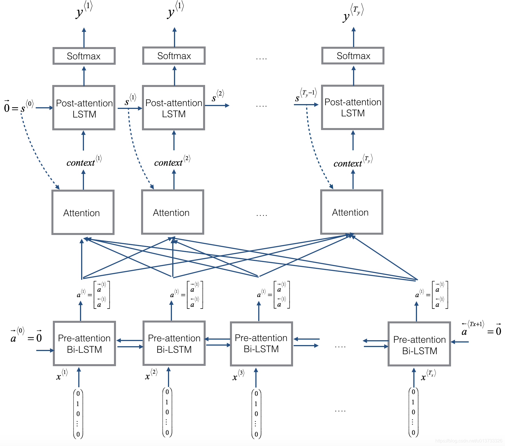
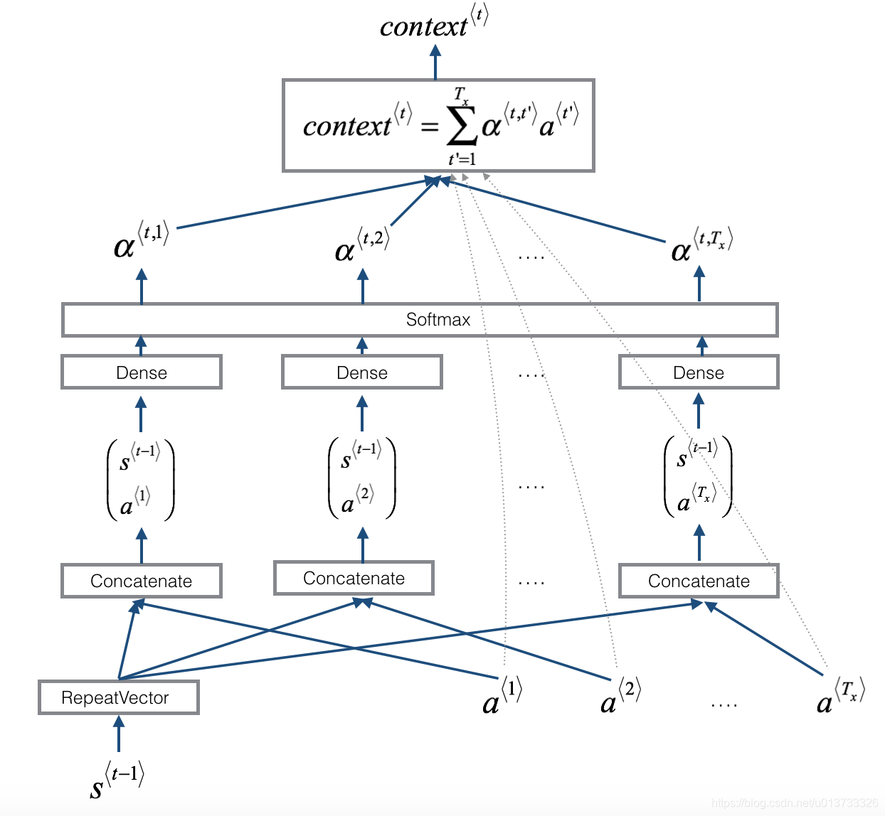

# Date Recognition with Attention Model

Human-readable date recognition with attention model and RNN.

Convert a user-input date like `May 23, 2025` into `yyyy-mm-dd` like `2025-05-23`.

This is a weekly exercise of the course [NLP Sequence Models](https://www.coursera.org/learn/nlp-sequence-models) Week 3, but built with PyTorch.

## On HuggingFace

[🤗HuggingFace Model](https://huggingface.co/Treep/DateRecogAttentionModel)

[🕹️HuggingFace Space](https://huggingface.co/spaces/Treep/DateRecogModel)

## Architecture

